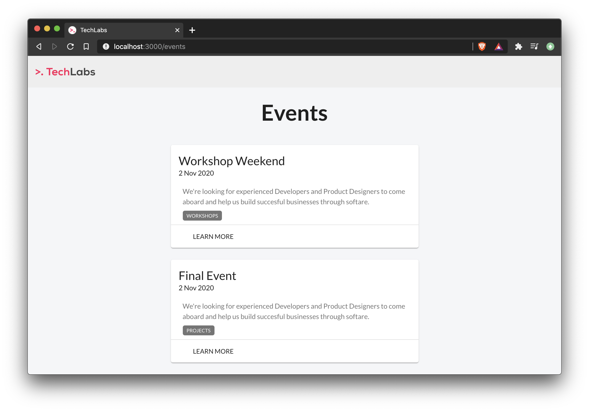

<h1 align="center">
	
	<br>
	<br>
</h1>

<br>
<br>

<p align="center"> Sample app used during my "Building a modern front-end application for your project" workshop.</p>

<br>
<br>

## Getting Started

Clone the repository.

```sh
git clone https://github.com/ythecombinator/techlabs-workshop-weekend-2020
```

`cd` into the directory.

```sh
cd techlabs-workshop-weekend-2020
```

Install the project dependencies:

```sh
yarn

# or

npm install
```

Start the development server:

```sh
yarn start

# or

npm run start
```

🚀 Head over to [localhost:3000](http://localhost:3000) in your browser of choice.

## Toolbelt

- [x] React as a UI language
- [x] Typescript for compile-time safety and code scalability with Interface oriented development
- [x] Material UI as our design toolkit
- [x] Formik + Yup for forms and their validation
- [x] SWR for data fetching
- [x] Day.js for date handling

## Project Structure

The project follows a regular [create-react-app](https://github.com/facebook/create-react-app) skeleton with very few modifications.

Under the src folder, we have two main directories:

### `shared`:

Which contains, as the name suggests, shared behavior, including:

- `assets/`: Images, CSS files, and other static assets
- `components/`: Components reused across pages
- `layouts/`: Reusable Layouts
- `models/`: Shared interfaces, enums, type aliases, and other TypeScript stuff
- `utils/`: Helper functions reusable across the project

### `modules/`:

These are each isolated functionality. Examples are:

- `auth`, split into `sign-in` and `sign-up`;
- `home`
- `events`

Each module is organized in:

- `components/`: Components relevant to that page
- `hooks`: Selectors, data access and mutation, and other hooks
- `models/`: TypeScript relevant stuff

Directories look like this:

```sh
|-- shared/
|   |-- api/
|   |-- assets/
|   |-- components/
|   |-- core/
|   |-- layouts/
|   |-- models/
|   |-- utils/
|   |-- ...
|-- modules/
|	|-- auth/
|		|-- sign-in/
|		|   |-- ...
|		|-- sign-up/
|		|   |-- ...
|	   	|-- ...
|	|-- events/
|		|-- components/
|		|-- core/
|		|-- hooks.ts
|		|-- models.ts
|		|-- index.ts
|		|-- ...
|   |-- ...
|   |-- api/
|   |-- assets/
|   |-- components/
|   |-- core/
|   |-- layouts/
|   |-- models/
|   |-- utils/
```
